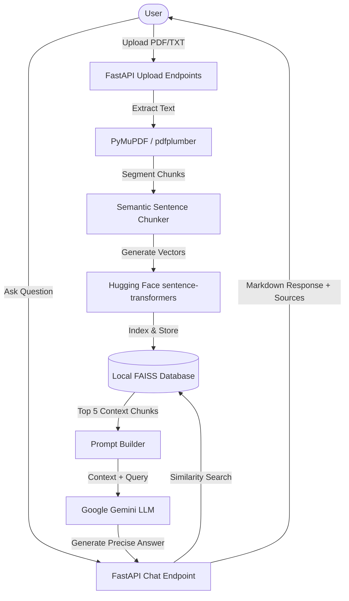

# AI-Powered Document Question Answering System (DocQA)

A production-grade, minimal, and fully local Retrieval-Augmented Generation (RAG) system built from scratch. It allows users to upload single or multiple documents (PDF and TXT), processes and indexes them into a local FAISS vector store using Sentence Transformers (`all-MiniLM-L6-v2` embeddings), and answers questions in natural language with source attribution, powered by Google Gemini.

---

## Architecture Diagram



---

## Features

- **Multi-Document Support**: Upload single or multiple PDF/TXT files (up to 20MB per file).
- **Hybrid Text Extraction**: PyMuPDF as the high-speed parser, falling back to pdfplumber for table structures and complex layouts, and pypdf as a final fallback.
- **Semantic Sentence Chunking**: Groups sentences within 700-1000 character boundaries, preventing cutoffs mid-sentence.
- **Local & API Embeddings Fallback**: Generates sentence embeddings locally using Hugging Face's `all-MiniLM-L6-v2` (384 dimensions) by default, and automatically falls back to Gemini's `text-embedding-004` API (768 dimensions) if local model loading fails. Cosine similarity is handled dynamically.
- **Fast Local Search**: Utilizes FAISS (Facebook AI Similarity Search) index with FlatIP (inner product similarity) for Cosine similarity lookups, handling dimension switches automatically.
- **Hallucination Prevention**: Prompt engineering enforces answering *only* from context. If answers are missing, it defaults to: *"I couldn't find relevant information in the uploaded documents."*
- **Source Citation**: Matches every answer with source document names and chunk IDs.
- **Document Summarization**: Instantly summarize the entire knowledge base content at the click of a button.
- **Download Chat History**: Export the full chat conversation as a clean Markdown file.
- **Responsive Theme**: Premium minimal UI styled in slate and brand-blue colors, equipped with a Dark Mode toggle.

---

## Tech Stack

### Frontend
- **React (Vite)**
- **Tailwind CSS**
- **Axios**
- **Framer Motion**
- **React Icons**
- **React Markdown**

### Backend
- **Python**
- **FastAPI**
- **Uvicorn**
- **PyMuPDF / pdfplumber**
- **Sentence Transformers**
- **FAISS**
- **Google Generative AI**

---

## Project Structure

```
Document-QA-System/
├── README.md
├── .env.example
├── .gitignore
├── sample.pdf                # Test sample PDF
├── frontend/
│   ├── package.json
│   ├── vite.config.js
│   ├── tailwind.config.js
│   ├── postcss.config.js
│   ├── index.html
│   └── src/
│       ├── main.jsx
│       ├── App.jsx
│       ├── components/
│       │   ├── UploadSection.jsx
│       │   ├── ChatBox.jsx
│       │   ├── MessageBubble.jsx
│       │   ├── Sidebar.jsx
│       │   ├── Loader.jsx
│       │   ├── Navbar.jsx
│       │   └── EmptyState.jsx
│       ├── pages/
│       │   └── Home.jsx
│       ├── services/
│       │   └── api.js
│       ├── hooks/
│       │   └── useChat.js
│       └── styles/
│           └── App.css
└── backend/
    ├── requirements.txt
    ├── app.py
    ├── config.py
    ├── utils.py
    ├── routes/
    │   ├── upload.py
    │   └── chat.py
    ├── services/
    │   ├── pdf_parser.py
    │   ├── text_parser.py
    │   ├── chunking.py
    │   ├── embeddings.py
    │   ├── vector_store.py
    │   ├── rag_pipeline.py
    │   └── llm.py
    ├── models/
    │   ├── request_models.py
    │   └── response_models.py
    ├── uploads/              # Storage folder for files
    ├── vectors/              # Local storage folder for FAISS indexes
    └── logs/                 # Local folder for app logs
```

---

## Installation & Setup

### Prerequisites
- Python 3.10+
- Node.js 18+

### Step 1: Environment Settings
1. In the backend directory, copy `.env.example` to `.env`:
   ```bash
   cp .env.example .env
   ```
2. Open `.env` and fill in your Google Gemini API Key:
   ```env
   GEMINI_API_KEY=your_gemini_api_key_here
   ```

### Step 2: Run the Backend
1. Navigate to the backend directory:
   ```bash
   cd backend
   ```
2. Initialize virtual environment and activate:
   - **Windows (PowerShell)**:
     ```powershell
     python -m venv venv
     .\venv\Scripts\Activate.ps1
     ```
   - **Mac/Linux**:
     ```bash
     python -m venv venv
     source venv/bin/activate
     ```
3. Install dependencies:
   ```bash
   pip install -r requirements.txt
   ```
4. Start the server:
   ```bash
   uvicorn app:app --port 8001 --reload
   ```
   The backend API documentation will be available at `http://localhost:8001/docs`.

### Step 3: Run the Frontend
1. Navigate to the frontend directory:
   ```bash
   cd ../frontend
   ```
2. Install node packages:
   ```bash
   npm install
   ```
3. Run the development server:
   ```bash
   npm run dev
   ```
4. Open your browser to the URL printed in the console (usually `http://localhost:5173` or `http://localhost:5174`).

---

## API Documentation

### `POST /upload`
- **Description**: Upload and parse multiple PDF/TXT files and index them into the FAISS store.
- **Request**: Multipart Form Data with file binaries.
- **Response**: List of parsed file details.

### `POST /ask`
- **Description**: Retrieve context from the vector database and generate an answer from the LLM.
- **Request Body**:
  ```json
  {
    "question": "What is the capital of France?"
  }
  ```
- **Response Body**:
  ```json
  {
    "answer": "The capital of France is Paris.",
    "sources": [
      {
        "source": "sample.pdf",
        "chunk_index": 0,
        "score": 0.85
      }
    ]
  }
  ```

### `GET /files`
- **Description**: List all uploaded files currently indexing.

### `DELETE /reset`
- **Description**: Wipe the knowledge base. Deletes all uploaded files, resets vectors, and clears chat.

### `POST /summarize`
- **Description**: Generate a document summary based on all uploaded files.

### `GET /health`
- **Description**: Health check endpoints returning configuration and api key validation status.

---

## Future Improvements
- **Hybrid Search**: Combine keyword lexical search (BM25) with vector similarity search for improved retrieval.
- **Reranking**: Integrate Cohere or cross-encoders to rank the top retrieved chunks before context construction.
- **Authentication**: User logins and isolated workspaces.

---

## License
MIT License.
