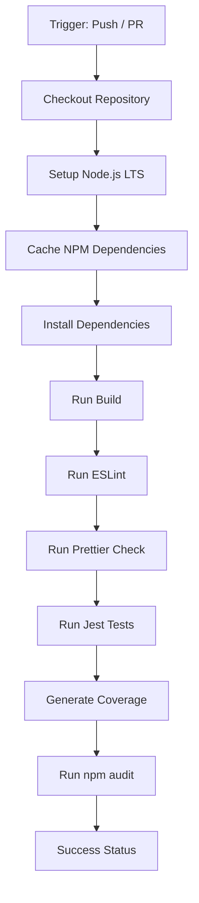

# Continuous Integration Pipeline with GitHub Actions

A production-ready, modular, and professional Continuous Integration (CI) template for Node.js / Express applications. It includes automated linting, formatting checks, unit tests, code coverage generation, dependency vulnerability auditing, and GitHub CodeQL static application security testing (SAST).

## Features

- **Automated Workflows**: Fully automated GitHub Actions pipeline executing on push and pull requests.
- **Express.js API**: Modular, clean ES modules server structure.
- **Robust Testing**: Fully configured Jest and Supertest setup with coverage metrics.
- **Linter & Formatter**: Clean standards enforced via ESLint and Prettier.
- **Vulnerability Auditing**: Active security analysis using `npm audit` and CodeQL.

## Folder Structure

```text
CI-GitHub-Actions/
├── .github/
│   └── workflows/
│       ├── ci.yml            # CI validation workflow
│       └── codeql.yml        # Security scanning workflow
├── src/
│   └── app.js                # Express application entry
├── tests/
│   └── app.test.js           # Unit & integration tests
├── .eslintrc.json            # ESLint rules
├── .gitignore                # Git paths to ignore
├── .prettierrc               # Prettier configuration
├── LICENSE                   # License details
├── package.json              # App configuration and scripts
└── README.md                 # Project documentation
```

## Technologies Used

- **Node.js** (LTS)
- **Express.js**
- **JavaScript** (ES6 Modules)
- **Jest**
- **ESLint**
- **Prettier**
- **GitHub Actions**
- **CodeQL**

## GitHub Actions Workflow

### Pipeline Execution Order



### Validation Checks

- **Build**: Verifies standard packaging and build scripts exit successfully.
- **Linting**: Enforces code style, unused variable checks, and import extensions rules.
- **Formatting**: Verifies layout conformity across all code blocks.
- **Tests**: Runs Jest assertions for server endpoints and routing error boundaries.

### Security Scanning

- **npm audit**: Scrapes installed packages for known vulnerabilities.
- **CodeQL SAST**: Triggers semantic scan on JavaScript codebase on every main line change, pull requests, and weekly schedules.

## Installation

Clone the repository and install all dependencies:

```bash
npm install
```

## Local Development

To run the application locally in watch mode:

```bash
npm run dev
```

The server runs on port `3000` by default.

## Available Scripts

### Running Tests

Execute the test suites via Jest:

```bash
npm test
```

### Generating Coverage Report

Generate the code coverage report:

```bash
npm run test:coverage
```

### Running Lint Checks

Audit JavaScript code quality with ESLint:

```bash
npm run lint
```

Automatically fix linting issues:

```bash
npm run lint:fix
```

### Running Formatter Checks

Check if files are formatted correctly with Prettier:

```bash
npm run format:check
```

Format all files:

```bash
npm run format
```

### Running Build Validation

Validate build sanity:

```bash
npm run build
```

### Running Security Audits

Identify vulnerabilities in the project's dependency tree:

```bash
npm run audit
```

## GitHub Actions Explanation

The workflow configurations reside in `.github/workflows/`.

- `ci.yml` defines the `Continuous Integration Pipeline` triggering checks on branches `main` and `master`. It performs installation, testing, linting, formatting checks, and audits.
- `codeql.yml` configures advanced security analytics scanning via CodeQL to intercept security regressions before they hit production.

## Media & Visuals

### Screenshots

_Placeholder for active GitHub workflow logs._

### Demo Video

_Placeholder for video showcasing continuous deployment pipeline._

## Future Improvements

- Add Docker containers build stage check.
- Include automated Semantic Versioning and Release generation.
- Integrate unit and system checks reporting into Pull Request comments.

## License

This project is licensed under the MIT License. See [LICENSE](LICENSE) for details.
