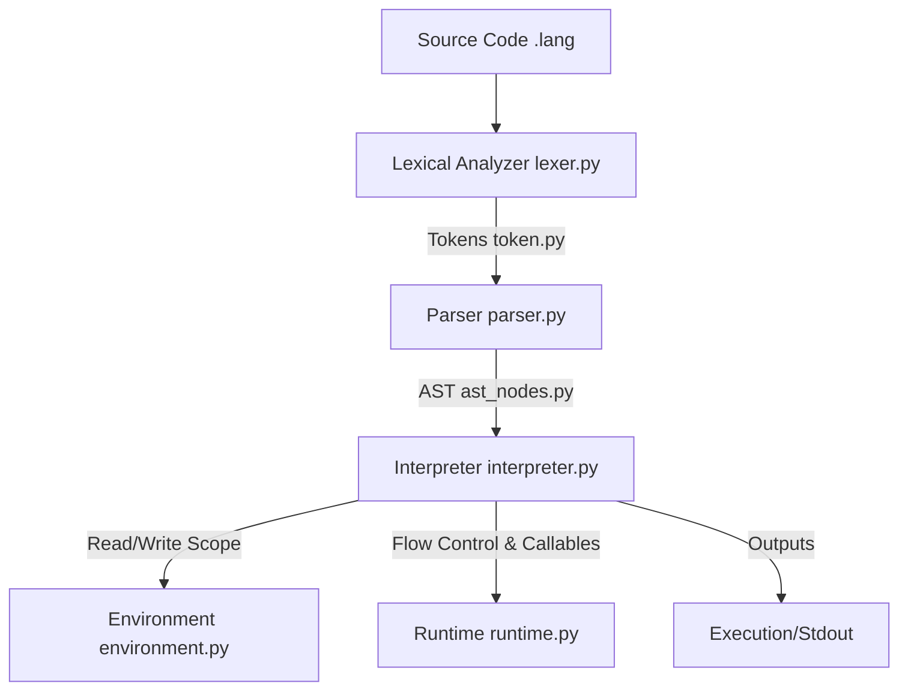

# Architecture Documentation

This document explains the architecture of the **MiniLanguage** interpreter and how its components interact.

## Architectural Overview

MiniLanguage is implemented as a classic tree-walking interpreter. The architecture is modular, consisting of distinct phases that progress sequentially.

---

## Component Responsibilities

### 1. Lexical Analyzer (`lexer.py`)
- **Input**: Raw text (source code character stream).
- **Task**: Performs scanning. It groups characters into logical chunks called **Tokens** (defined in `token.py` and `tokens.py`).
- **Details**:
  - Skips whitespaces.
  - Skips comments starting with `#`.
  - Distinguishes between keywords (like `let`, `if`, `while`, `fn`), identifiers (variable/function names), integer literals, and string literals.
  - Reports `LexerError` if it encounters invalid characters or an unterminated string.

### 2. Parser (`parser.py`)
- **Input**: A list of tokens produced by the Lexer.
- **Task**: Performs syntactic analysis. It constructs an **Abstract Syntax Tree (AST)** by validating the sequence of tokens against the language grammar rules.
- **Details**:
  - Employs a **Recursive Descent** parsing technique.
  - Enforces operator precedence (logical OR/AND, comparisons, arithmetic operations).
  - Validates structures like matching parentheses, variable declarations, loops, and function parameters.
  - Reports `ParserError` with line and column numbers on syntax errors.

### 3. AST Nodes (`ast_nodes.py`)
- **Task**: Defines structural node classes representation of the program.
- **Details**:
  - Distinguishes between **Statements** (nodes that perform actions, like `IfStmt`, `PrintStmt`, `WhileStmt`, `VarDecl` but do not return a value) and **Expressions** (nodes that evaluate to a value, like `BinOp`, `Literal`, `Identifier`, `FnCall`).

### 4. Environment (`environment.py`)
- **Task**: Manage variable storage and scoping rules.
- **Details**:
  - Implements lexical scoping using a tree structure where child environments hold a reference to their parent environment.
  - Looking up or assigning a variable traverses upward through parent environments to find where the variable is defined.
  - Raises a `RunTimeError` for references to undefined variables.

### 5. Interpreter & Runtime (`interpreter.py` & `runtime.py`)
- **Task**: Recursively executes statement nodes and evaluates expression nodes.
- **Details**:
  - The interpreter uses tree-walking recursion.
  - Employs Python exceptions (`BreakSignal`, `ContinueSignal`, `ReturnValue`) to propagate control signals for loops and functions.
  - Prompts for stdin on `input` statements and converts numeric-only input to integers automatically.
  - Evaluates binary and unary operations, validates operand types, and prevents divisions by zero.
